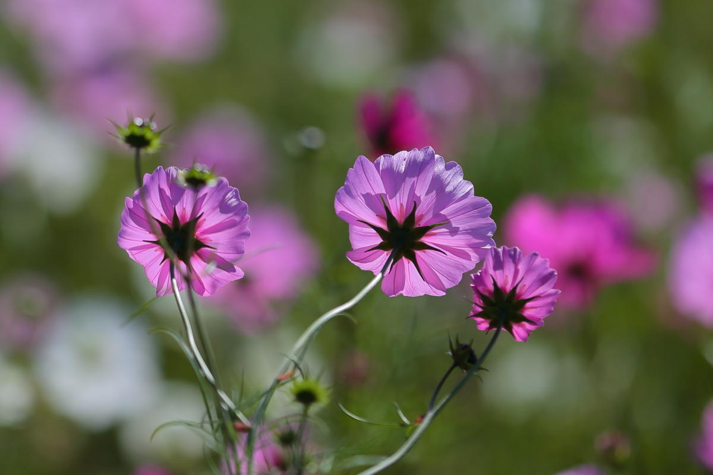
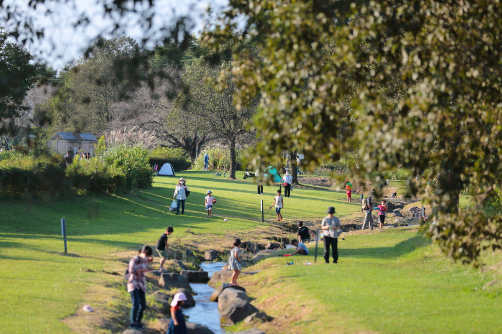
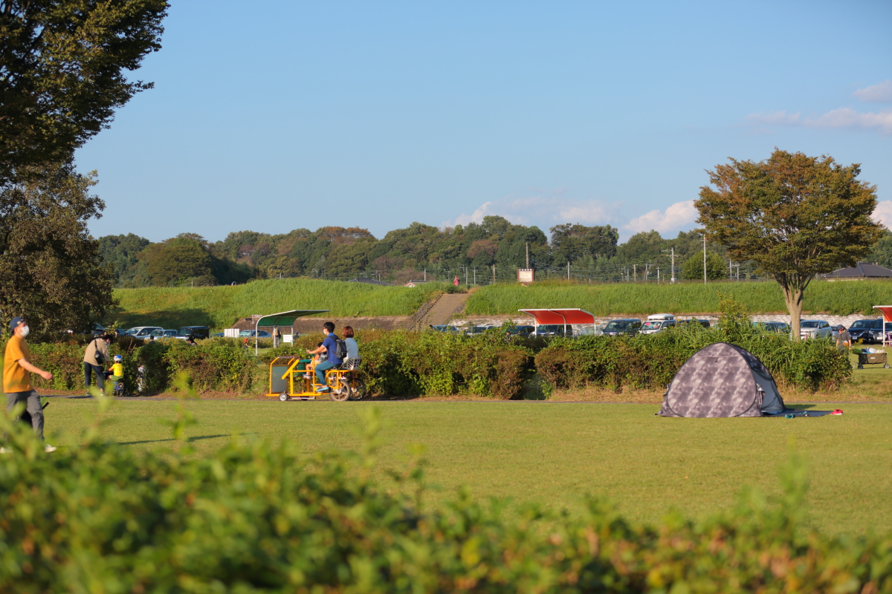
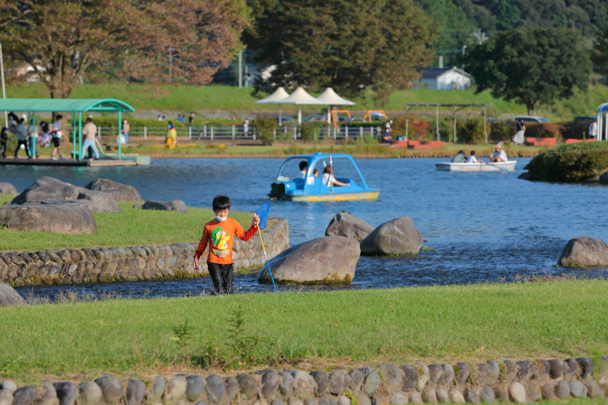
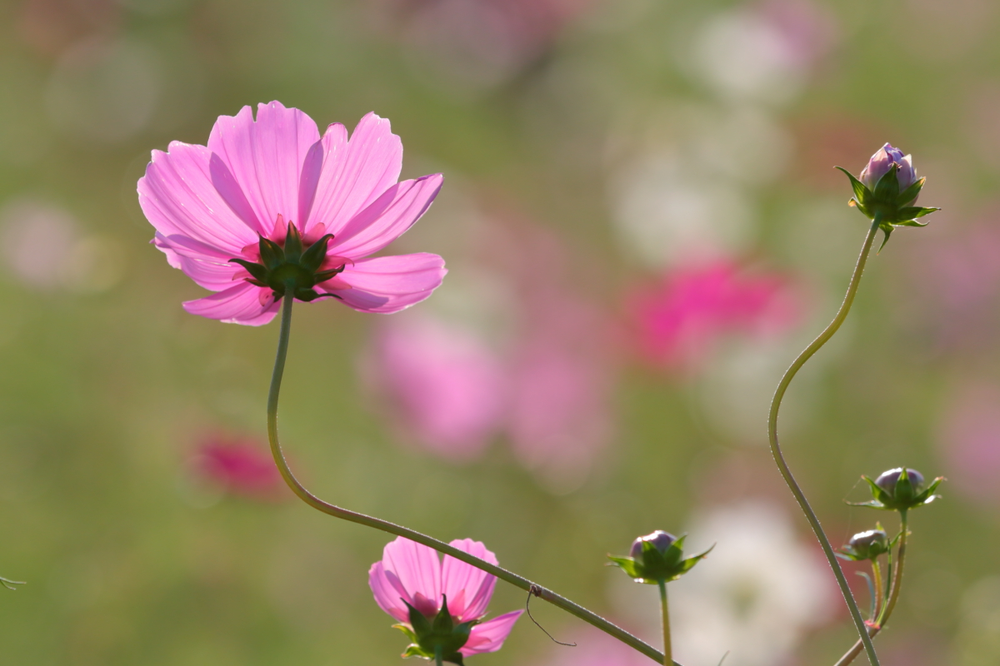
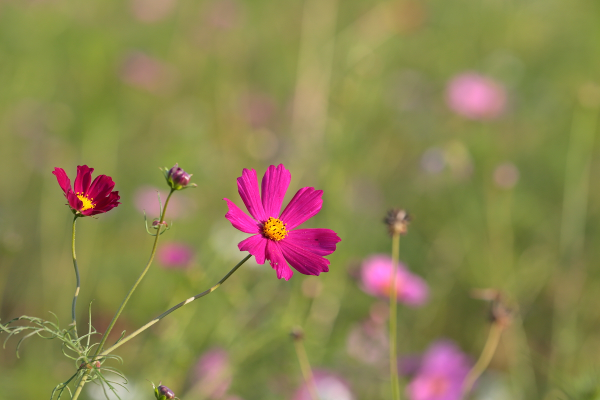

# greenpark_cosmos

<html>
<head>

<meta charset="UTF-8">
<meta http-equiv="Content-Type" content="text/html; charset=UTF-8">
<meta http-equiv="X-UA-Compatible" content="IE=EmulateIE10" />
<meta http-equiv="X-UA-Compatible" content="IE=edge">

<!--ここから上はお決まりの定型文です-->

<!--ここからが表現の書式などを決めるcssという部分-->

<link href="https://cdnjs.cloudflare.com/ajax/libs/lightbox2/2.7.1/css/lightbox.css" rel="stylesheet">

</head>

<body>

  モバイル端末をお使いの場合は、画面を横向きにすると
  より見やすくご覧頂けます。

    
<!--ここまでは定型文としてそのままコピペして再利用します—->

<!-—リンクの作り方、例
<a href="ここにリンク先のURLを入れる" target="_blank" rel="noopener noreferrer">新規タブで開く</a>-—>

<!-—ぱんくずリストの表示例-—>
<!--今回は未使用

<a href="https://torokoid.github.io/fts_home">Home</a>>同窓会

—->

<!—-表題の表示、背景黄色、流れ文字の例-->
<h1><marquee behavior="alternate">!!! 2021年10月29日(金)、秋晴れの青空の下、宝積寺グリーンパークのコスモス !!!</marquee></h1>

<h3>10月最終の週末、空気も澄んでお花たちも元気、遠くの山々も綺麗に見えていました ！</h3>

                                       

<!—-表題の表示、背景黄色、流れ文字の例-->
<h1><marquee behavior="alternate">!!! 2021年10月3日(日)、緊急事態宣言解除後、初の週末。宝積寺グリーンパークのコスモス !!!</marquee></h1>

<!--

-->

<!--QRコードの表示例-->
<!--
 アクセス用QRコード
-->

                                       

<h3>宇都宮駅から北東に約10km、コスモスはまだ７分咲きだけど、凄い人手でした ！</h3>

<!--

-->
                                       

<!-- フッタ -->
 <footer>
   <h3>Copyright 2021/10/03 S.Hada</h3>
 </footer>

<!--HPにさまざまなJavaScriptを呼び込むための書式-->

</body>

</html>
